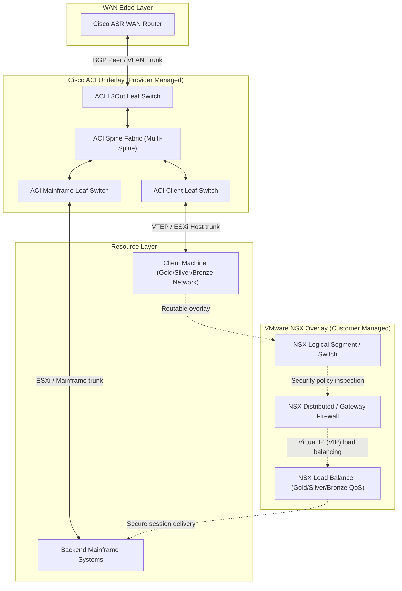

# Blueprint: Hybrid Enterprise Fabric & Virtual Services Orchestration

This blueprint defines the architecture, physical topology, logical service overlay, and automation boundaries for a multi-vendor datacenter network. The design integrates a provider-managed **Cisco ACI underlay** fabric with customer-managed **VMware NSX virtual overlays** (Firewalls, Load Balancers, Segments) to deliver secure connectivity between WAN clients and backend Mainframe resources.

---

## 🏛️ Architecture Overview

The system architecture decouples physical hardware provisioning from virtual network services:
1.  **Physical Edge & Underlay (Provider-Managed)**: Standard Cisco ASR WAN edge routers connected via Layer 3 Out (L3Out) leaf switches into a multi-spine ACI fabric. 
2.  **Virtual Services Overlay (Customer-Managed)**: VMware NSX running on top of ACI. Customers provision virtual routing segments, firewalls (NSXFW), and load balancers (NSXLBs) overlaying the ACI fabric.
3.  **End-to-End Objective**: Route incoming client traffic from the WAN, through ACI, into the customer's NSX overlay security boundary, load balance it, and securely deliver it to mainframe systems.

---

## 🗺️ System Topology

### Physical & Logical Topology Diagram

The following diagram illustrates the path from the WAN edge, through the ACI fabric underlay, up to the NSX overlay virtual security structures, and finally to the client and mainframe endpoints:




---

## 🗂️ Management Boundaries & Roles

To ensure security and operations separation, the management plane is split:

| Layer | Component | Managed By | Control Scope |
| :--- | :--- | :--- | :--- |
| **Physical WAN Edge** | Cisco ASR Routers | Network Ops / Enterprise | BGP peers, WAN access-lists, VRF configurations. |
| **Datacenter Fabric** | Cisco Nexus Spine & Leaf | Datacenter Provider (ACI) | Underlay leaf-to-spine routing, physical L3Out mapping, VXLAN-to-VLAN transport encapsulation. |
| **Virtual Security** | NSX Distributed Firewall (NSXFW) | Security Team / Client | micro-segmentation, East-West firewall rules, Threat prevention. |
| **Load Balancing** | NSX Load Balancer (NSXLB) | App / Tenant Owner | Virtual Server VIPs, Health Monitors, SSL Offloading, Traffic profiles (Gold/Silver/Bronze). |
| **Overlay Switching** | NSX Logical Segments | Virtualization Admins | Virtual machine vNIC ports, logical overlay encapsulation. |

---

## ⚙️ Detailed Component Specifications

### 1. Cisco ASR WAN Edge Router
*   **Purpose**: Manages border routing and incoming tenant WAN traffic.
*   **Routing**: Standard BGP configuration peering with ACI L3Out leaves.
*   **QoS Shaping**: Enforces class-maps mapping the client tiers:
    *   **Gold**: Guaranteed 100 Gbps, strict priority queuing.
    *   **Silver**: Guaranteed 10 Gbps, standard queuing.
    *   **Bronze**: Max rate-limit 1 Gbps, low-priority queuing.

### 2. Cisco ACI Underlay Fabric (Nexus switches)
*   **Role**: Operates strictly as a **transparent Layer 2 Transit Underlay** (no Layer 3 routing terminates on ACI).
*   **Transit VLANs**: ACI Leaf switches use simple VLAN EPGs to bridge traffic between the physical Cisco ASR WAN interface and the physical NSX Edge uplink interfaces.
*   **Jumbo MTU Underlay**: Fabric interfaces are configured with a **Jumbo MTU (9000 bytes)** to carry encapsulated Geneve/VXLAN overlay packets (which carry a 50-byte header overhead) without packet fragmentation.
*   **Mainframe VLAN**: Provides L2 connectivity between the physical mainframe OSA/RoCE adapters and the logical NSX Tier-0/Tier-1 virtual interfaces.

### 3. VMware NSX Overlay Objects
*   **Tier-0 Gateway Router**: Establishes **direct BGP peering with the Cisco ASR WAN Router** over the ACI L2 Transit VLAN. It handles all external WAN routing advertisements.
*   **Tier-1 Gateway Router**: Handles internal routing for client segments and provides default gateways for client and mainframe zones.
*   **Logical Switches (NSX Segments)**: Geneve-encapsulated L2 segments. Client and Mainframe traffic is routed directly at the hypervisor/edge host level.
*   **Distributed Firewall (NSXFW)**: Applies security micro-segmentation directly at the VM vNIC level.
*   **NSX Load Balancer (NSXLB)**: Manages load-balanced traffic pools for mainframe services.

---

## 🔄 End-to-End Transparent Underlay Traffic Walk

Traffic flows from the client to the mainframe, routing entirely through NSX gateways while ACI bridges the frames transparently:

```
[Client Machine]
      │
      ▼ (Sends traffic to WAN Gateway)
[Cisco ASR WAN Router] ───► Mapped to [Client-Specific VRF]
      │
      ▼ (BGP Peered Directly to NSX Edge Interface)
[ACI L2 Transit VLAN] ───► (ACI Leaf/Spine underlay bridges packet transparently)
      │
      ▼ (L3 Routing boundary)
[NSX Tier-0 Gateway]
      │
      ▼ (Secured by NSX Firewall Policies)
[NSX Distributed Firewall (NSXFW)]
      │
      ▼ (Routed to virtual load-balancer VIP)
[NSX Load Balancer (NSXLB)]
      │
      ▼ (Forwarded to physical mainframe over mainframe VLAN segment)
[ACI Mainframe VLAN] ───► (ACI Leaf bridges packet to physical adapter)
      │
      ▼
[Mainframe System]
```

---

## 💻 Web GUI Specifications & Interactive Mockup Sections

The frontend console implements dynamic control mechanisms to manage this workflow:

### 1. Variable Editor Panel
Allows real-time customization of underlying device templates. Changes compile immediately into Python dictionary variables:
*   **IP Addressing**: Configure sub-interfaces, gateway VIPs, and routing peer IPs.
*   **VRF Names**: Custom naming fields mapped across the ASR WAN router and Core Nexus.
*   **ACI Tenant & Contracts**: Define Tenant Names, Bridge Domains, and ACI Security Contracts (Consumer/Provider relationships).

### 2. NSX Virtual Services Configurator
*   **NSX Firewall Rule Builder**: A table widget allowing users to add, edit, and delete gateway firewall rules (Source Segment, Target Segment, Service Port, Action: `ALLOW`/`DROP`).
*   **NSX Load Balancer Policies**: Setup sub-sessions to configure LB VIPs, active health checks, and bind QoS bandwidth profiles (Gold/Silver/Bronze) directly to traffic sessions.

### 3. Isolated Customer Automation Sessions
When a new network is created for a client, the console spins up an isolated **Automation Session** tab:
*   **Session Isolation**: The user can switch between different Customer Session logs.
*   **Real-time Output**: Displays a dedicated terminal logging dry-runs, syntax checking, and simulated python output specific only to that client's VRF, ACI, and NSX configurations.
*   **Heartbeat Monitor**: Visual ping-traces and API connectivity statuses rendered dynamically per client session.

---

## 🛠️ Python Automation Scripting Architecture

To achieve high-speed concurrency and direct API control, the automation backend is driven by **Python 3.10+** utilizing **Nornir** for physical devices and **Requests** for virtual services REST API integration.

### 1. Automation Framework Stack
*   **Concurreny Engine (Nornir)**: Orchestrates simultaneous connections to physical edge devices. Provides inventory management and structured logging with 0% YAML overhead.
*   **ASR Connection Driver (Scrapli / Netmiko)**: Direct multi-threaded SSH drivers to push BGP config lines, access-lists, and hierarchical QoS service-policies to Cisco ASR.
*   **NSX-T REST Client (Requests / HTTPX)**: Communicates directly with NSX-T Manager REST API endpoints. Bypasses heavy SDK libraries by posting raw JSON schema payloads directly to `/api/v1/` routes.

### 2. Scripting Directory Structure
```
network_automation/
│
├── config.yaml               # Nornir inventory & device variables (Gold/Silver/Bronze)
├── hosts.yaml                # Device credentials (ASR Edge, NSX Manager)
│
├── orchestrator.py           # Core flow controller (orchestrates ASR & NSX sequences)
│
├── drivers/
│   ├── __init__.py
│   ├── cisco_asr.py          # Handles SSH CLI configuration push via Scrapli
│   └── nsx_api.py            # Direct REST HTTP client for NSX Segments, FW, & LBs
│
└── utils/
    ├── validator.py          # Validates port capacity and IP CIDR overlays before execution
    └── verify.py             # ICMP/HTTP validation scripts (ping/traceroute verification)
```

### 3. Execution Modules & API Endpoints

#### Module A: Cisco ASR Provisioning (`drivers/cisco_asr.py`)
*   Pushes configuration blocks to assign sub-interfaces, peer with ACI L3Outs, and apply policy-maps for QoS rate-limiting.
*   *Key commands*: `router bgp <asn>`, `policy-map <tier_name>`, `service-policy input <policy>`

#### Module B: NSX-T API Integration (`drivers/nsx_api.py`)
Direct HTTP requests made to NSX-T API endpoints:
*   **Logical Switches (Segments)**: `POST /api/v1/logical-switches` (binds virtual ports to tier networks).
*   **Security Policies (NSXFW)**: `POST /api/v1/firewall/sections` (inserts stateful Distributed Firewall rule sets).
*   **Load Balancing (NSXLBs)**: `POST /api/v1/loadbalancer/services` (configures Virtual Servers, Backend Pools, and Health Monitors).

#### Module C: Network Verification (`utils/verify.py`)
*   Executes dynamic ping traces from simulated tenant gateways to verify paths.
*   Retrieves REST API status checks from NSX Load Balancer VIPs to confirm backend mainframe reachability.
