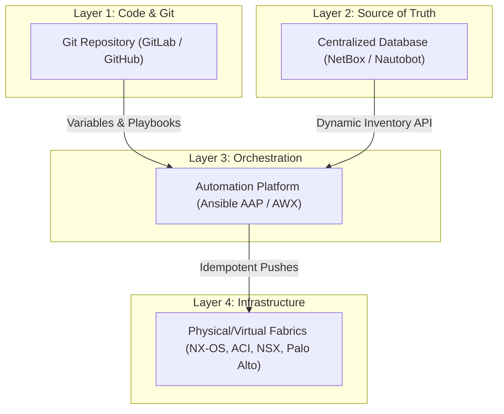
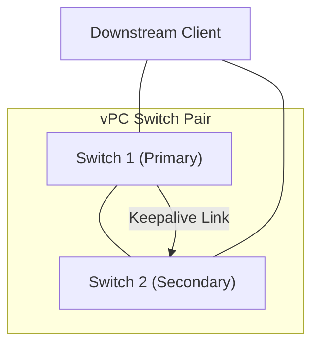
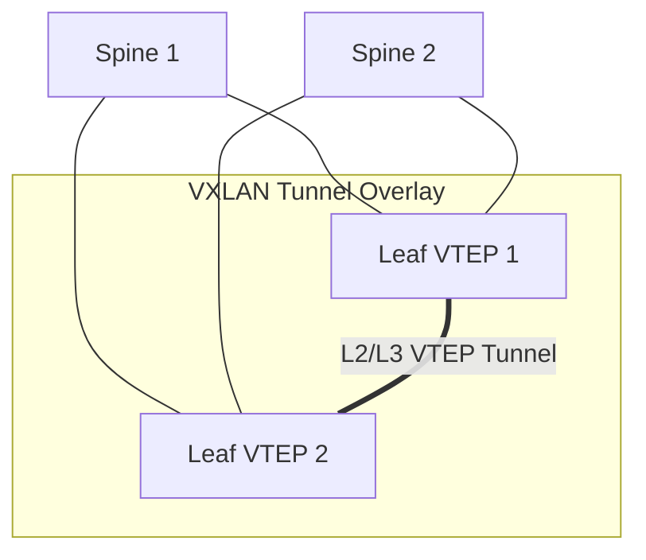
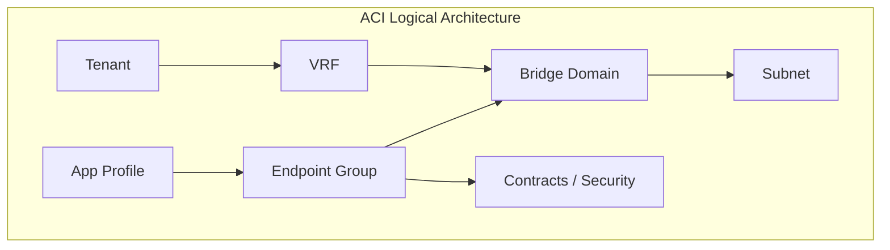
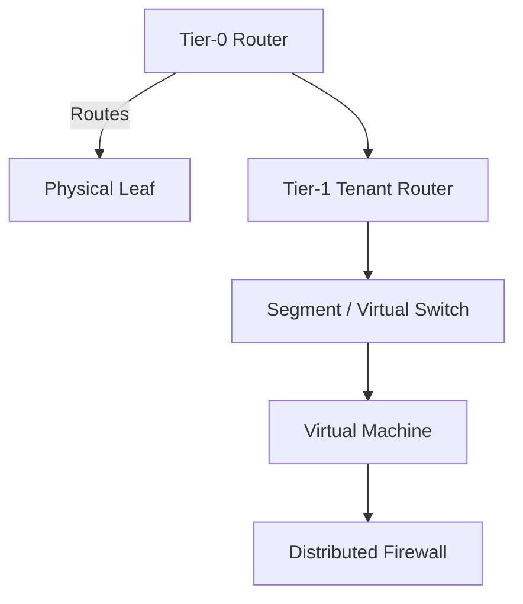
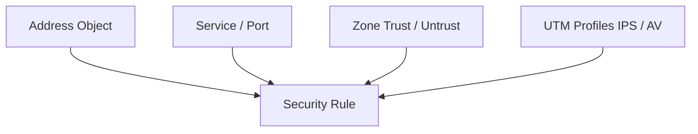
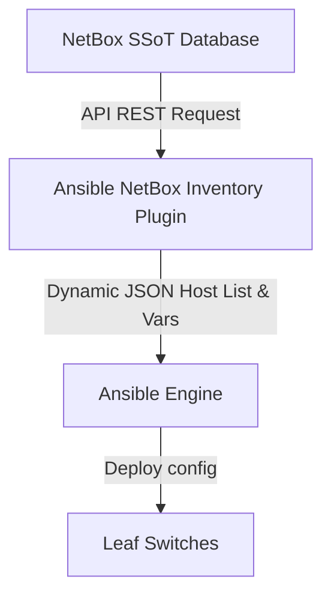

# Enterprise Network Automation: A Practical Textbook & Case Study Guide
*A Comprehensive Guide to Modern Infrastructure-as-Code (IaC) for Traditional Network Engineers*

---

> [!NOTE]
> ### Editor's Preface
> This textbook is written in a highly structured, educational style inspired by **Behrouz Forouzan**. Each chapter begins with clear architectural definitions, transitions into structural diagrams, provides concrete code blueprints, and details the exact "under-the-hood" mechanics of modern enterprise network automation.
> 
> Whether you are a traditional network engineer running prewritten scripts, or an architect designing a global GitOps deployment pipeline, this book is written as a clear, step-by-step learning reference that you can easily print to PDF and read offline.

---

# CHAPTER 1: The Foundations of Network Infrastructure as Code (IaC)

In traditional computer networking, network administration has historically been an *imperative* and *device-centric* workflow. To configure a feature, the network engineer establishes an SSH session to an individual switch, enters privileged configuration mode, and executes lines of CLI commands. 

In the modern enterprise, this model is replaced by **Infrastructure as Code (IaC)**, which is *declarative*, *data-driven*, and *controller/fabric-centric*.

```text
Traditional (Imperative)             Modern (Declarative)
+-------------------------+          +-------------------------+
| SSH into Device         |          | Define Desired State    |
| Run: "conf t"           |  =====>  | in a Structured Text    |
| Run: "vlan 10"          |          | File (YAML Variables)   |
| Run: "name CORP"        |          | and Push to Git         |
+-------------------------+          +-------------------------+
```

## 1.1 Core Definitions

### A. Imperative vs. Declarative
*   **Imperative Programming**: Focuses on *how* to achieve a result. You define the exact sequence of commands the switch must execute. If the switch is already in that state, it executes them anyway, which can cause warnings, duplicate logs, or transient link flaps.
*   **Declarative Programming**: Focuses on *what* the final result should be. You define the "desired state" of the switch (e.g., *"VLAN 10 must exist with name CORP"*). The automation engine is responsible for inspecting the device and figuring out the CLI commands needed to reach that state.

### B. The Principle of Idempotency
An operation is **idempotent** if running it multiple times yields the exact same result as running it once, without causing unintended side effects. 
*   *Non-idempotent example*: Appending a line to an Access Control List (ACL) via a basic script might add duplicate lines to the running configuration every time the script is executed.
*   *Idempotent example*: An Ansible module checks the active switch configuration. If the ACL rule is already present, it skips the execution. If it is missing, it adds it. The result is always a single, clean ACL rule.

---

## 1.2 The Enterprise Automation Stack

To operate at scale, enterprises divide automation into a **four-layer architectural model**:



1.  **Layer 1: Code & Configuration Repository (Git)**: Serves as the immutable version-controlled storage for playbooks and variable files.
2.  **Layer 2: Source of Truth (SSoT)**: A centralized database (typically **NetBox**) that holds the intended state of the network. It is the single database representing all IP allocations, cables, racks, and device roles.
3.  **Layer 3: Orchestration & Automation Platform (Ansible AAP / AWX)**: The centralized execution engine that securely retrieves credentials, pulls code from Git, queries the SSoT, and manages concurrent runs.
4.  **Layer 4: Network Fabric**: The target physical switches, virtual switches, hypervisors, and security appliances.

---

# CHAPTER 2: Core Layer 2/3 Automation (The Building Blocks)

Before automating advanced fabrics, you must build the foundational Layer 2 and Layer 3 interfaces. This chapter covers physical interfaces, Link Aggregation, vPC, HSRP, and dynamic routing.

## 2.1 Interface & Link Aggregation (LACP)

Physical ports are highly dynamic. Ansible leverages structured variables to provision port descriptions, trunking states, and **LACP Port-Channels**.

```text
    Physical Ports (Eth1/2, Eth1/3)            Logical Port-Channel (Po10)
    +-----------------------------+           +-----------------------------+
    | Speed: Auto, Duplex: Auto   |  ======>  | Mode: Trunk                 |
    | Channel-Group: 10 Active    |           | Spanning-Tree: Port Network |
    +-----------------------------+           +-----------------------------+
```

### The Ansible Variable Structure
Instead of hardcoding ports in the tasks, they are structured as a clean list of objects:

```yaml
# vars/interfaces.yml
lacp_port_channels:
  - id: 10
    description: "vPC Peer-Link Trunk"
    mode: "trunk"
    members:
      - "Ethernet1/2"
      - "Ethernet1/3"
```

### The Idempotent Playbook Execution
Ansible loops through the LACP objects and configures the physical member ports and the logical port-channel interface dynamically:

```yaml
- name: Configure Physical LACP Member Interfaces
  cisco.nxos.nxos_config:
    parents: "interface {{ item.1 }}"
    lines:
      - "description Member of Port-Channel{{ item.0.id }}"
      - "channel-group {{ item.0.id }} mode active"
      - "no shutdown"
  with_subelements:
    - "{{ lacp_port_channels }}"
    - members

- name: Configure Port-Channel Interface
  cisco.nxos.nxos_config:
    parents: "interface port-channel{{ item.id }}"
    lines:
      - "description {{ item.description }}"
      - "switchport"
      - "switchport mode {{ item.mode }}"
  loop: "{{ lacp_port_channels }}"
```

---

## 2.2 High Availability: vPC & HSRP

In enterprise datacenters, high availability is achieved by running **vPC (virtual Port-Channel)** at Layer 2 and **HSRP (Hot Standby Router Protocol)** at Layer 3 across a pair of switches.



### A. vPC Domain & Keepalive Configuration
The vPC domain allows two physical switches to appear as a single logical switch to downstream devices. It requires entering the `vpc domain <ID>` context and configuring a peer-keepalive path over the out-of-band management network.

### B. SVI & HSRP Virtual Gateway Configuration
HSRP provides default gateway redundancy. 
*   **Switch 1 (Primary)** is configured with a high HSRP priority (e.g., `150`) and **preemption** enabled, forcing it to act as the Active gateway.
*   **Switch 2 (Secondary)** is configured with a lower priority (e.g., `120`), acting as the Standby gateway.
*   Both switches share a single **Virtual IP (VIP)** which downstream client PCs use as their default gateway.

---

# CHAPTER 3: Software-Defined Datacenter Fabrics (VXLAN EVPN)

In large datacenters, Spanning Tree Protocol (STP) is disabled in the core. Instead, networks are built as a Layer 3 **Leaf-Spine Fabric** running **VXLAN EVPN (Virtual Extensible LAN with Ethernet VPN)**.



## 3.1 Underlay vs. Overlay

### A. The Underlay Network
The physical network. Its only job is to route packets between leaf and spine loopback interfaces. It runs an interior gateway protocol (typically **OSPF** or **eBGP**) and has jumbo frames enabled (MTU `9216`) to support VXLAN encapsulation overhead.

### B. The Overlay Network
The virtual network. It encapsulates Layer 2 Ethernet frames inside Layer 3 UDP packets (port `4789`). 
*   **VTEP (Virtual Tunnel Endpoint)**: The leaf switches that perform encapsulation and decapsulation.
*   **VNI (VXLAN Network Identifier)**: The virtual segment identifier. L2 VNIs correspond to Layer 2 VLANs, and L3 VNIs correspond to Layer 3 VRFs (routing tables).
*   **BGP EVPN**: The control plane. Instead of flood-and-learn, switches exchange host MAC and IP addresses dynamically using BGP MP-BGP.

---

## 3.2 Dynamic Tenant & VNI Object Schema

In a multi-tenant datacenter, adding a new customer or application segment requires creating a VRF (L3 VNI), a VLAN (L2 VNI), and starting an **EVPN Anycast Gateway**.

Ansible automates this complex configuration using a clean, object-oriented YAML model:

#### [vars/datacenter_fabric.yml](file:///d:/antigravity%20lenovo/ansibal%20cisco/vars/datacenter_fabric.yml)
```yaml
fabric_domain: "GE_US_EAST"

tenants:
  - name: "PRODUCTION_VRF"
    vni_l3: 50001
    anycast_gateway_mac: "0011.2233.4455"
    vlans:
      - id: 10
        name: "WEB_TIER"
        vni_l2: 30010
        subnet: "10.10.10.0/24"
        gateway_vip: "10.10.10.254"
      - id: 20
        name: "DB_TIER"
        vni_l2: 30020
        subnet: "10.10.20.0/24"
        gateway_vip: "10.10.20.254"
```

### The Leaf Switch Automation Playbook Tasks:
Ansible parses this dynamic structure to automate the NVE interface mappings and Anycast Gateways dynamically on all leaf switches:

```yaml
- name: Enable EVPN Anycast Gateway MAC globally
  cisco.nxos.nxos_config:
    lines:
      - "overlay address-evpn"
      - "ip arp synchronization"
      - "anycast-gateway-mac {{ tenant.anycast_gateway_mac }}"
  loop: "{{ tenants }}"
  loop_control:
    loop_var: tenant

- name: Map VLANs to L2 VNIs on leaf switches
  cisco.nxos.nxos_config:
    parents: "vlan {{ item.1.id }}"
    lines:
      - "vn-segment {{ item.1.vni_l2 }}"
  with_subelements:
    - "{{ tenants }}"
    - vlans
```

---

# CHAPTER 4: Software-Defined Networking (Cisco ACI & VMware NSX-T)

Modern datacenters are moving away from raw switch CLI configurations entirely, adopting Software-Defined Networking (SDN) solutions like **Cisco ACI** for physical hardware, and **VMware NSX-T** for virtual hypervisors.

---

## 4.1 Cisco ACI (Application Centric Infrastructure)

Cisco ACI models the entire datacenter as a single, centralized policy tree managed by **APIC controllers**. Ansible does not connect to the switches; it sends REST API HTTPS requests directly to the APIC.



### A. Logical Policy Objects
*   **Tenant (`fvTenant`)**: A complete administrative partition (e.g., `GE_POWER`).
*   **VRF (`fvCtx`)**: The private routing table space.
*   **Bridge Domain (`fvBD`)**: The Layer 2 boundary. Controls dynamic ARP learning and flooding behaviors.
*   **Subnet (`fvSubnet`)**: Default gateway IP bound inside a Bridge Domain.
*   **Endpoint Group (EPG - `fvAEPg`)**: The logical security container. Servers in the same EPG can communicate. EPGs must utilize **Contracts** containing Port/Protocol **Filters** to communicate with other EPGs.

### B. Access Policy Objects (Physical Hardware Mapping)
Access policies tell ACI what is physically cabled to the leaf ports:
*   **VLAN Pool (`fvnsVlanInstP`)**: Defines dynamic or static VLAN tag allocations.
*   **AAEP (`infraAttEntityP`)**: The attachable profile that maps VLAN pools to Interface Policy Groups (like LACP Active, LLDP enabled).
*   **Switch Profile (`infraNodeP`)**: Selects physical leaf node IDs.
*   **Interface Profile & Selector (`infraPortBlk`)**: Selects the physical ports (e.g. ports `1/1-12`) and binds them to interface policies.

---

## 4.2 VMware NSX-T (Virtual Hypervisor Networks)

VMware NSX-T virtualizes switching, routing, and firewalls directly inside the ESXi kernel. Ansible automates NSX using REST APIs directed at the NSX Manager.



### A. Logical Gateways
*   **Tier-0 (T0) Gateway**: Routes traffic between virtual segment switches and the physical network (Leafs). Supports BGP peerings, dynamic ECMP routing, and NAT.
*   **Tier-1 (T1) Gateway**: Multi-tenant, division-level router. Connects downstream to segment switches and upstream to the T0.

### B. Segment Switches
*   **Segment**: The virtual L2 switch. Defines the virtual subnet, gateway IP, and associated DHCP/QoS profiles.

### C. Distributed Firewall (DFW) & Micro-Segmentation
The DFW runs in the hypervisor kernel at the virtual NIC level, providing security rules for VMs regardless of their IP or subnet.
*   **NSX Group**: Logical groupings based on dynamic VM parameters (e.g., VM Name starts with `WEB-`, OS type is `Windows Server`, or VM carries tag `PCI-DSS`).
*   **DFW Rules**: Source Group, Destination Group, Services (ports/protocols), and Actions (Allow, Drop, Reject).

---

# CHAPTER 5: Enterprise Edge Security Automation (Palo Alto & Fortinet)

Firewall policy changes are the most frequent tickets in enterprise networks. Automating changes on **Palo Alto Panorama** and **Fortinet FortiManager** is critical for operational speed and compliance.



## 5.1 Address & Service Objects

Enterprises represent network nodes, networks, and services as reusable objects to ensure security policies stay clean and readable.

*   **Address Object**: Defines an IP address (`10.10.10.50`), a subnet IP (`10.20.0.0/16`), or an FQDN (`*.googleapis.com`).
*   **Address Group**: Static or dynamic combinations of address objects.
*   **Service Object**: Defines IP protocol ports (e.g. TCP port `8443` or UDP port `500`).
*   **Service Group**: Groups multiple service objects together (e.g., `ACTIVE_DIRECTORY_SERVICES`).

---

## 5.2 Security Policies & Rulebases

The core security policy allows or drops traffic between network security zones based on the defined objects.

*   **Security Policy Rule**: Binds Source Zone, Destination Zone, Source Address, Destination Address, Applications, Services, and Actions.
*   **UTM (Unified Threat Management) Profiles**: Advanced packet scanning applied to an allowed rule:
    *   *Intrusion Prevention (IPS)*: Blocks exploits and vulnerability attacks.
    *   *Anti-Virus / WildFire*: Inspects files mid-stream and blocks malware.
    *   *URL Filtering*: Blocks access to malicious web domains.
    *   *Decryption Profile*: Instructs the firewall to perform SSL decryption on specific outbound traffic streams to scan payloads for advanced threats.

---

# CHAPTER 6: Global WAN & VPN Automation (SD-WAN & DMVPN)

Connecting distant datacenters and branch office sites together requires **Software-Defined WAN (SD-WAN)** or traditional **IPsec / DMVPN (Dynamic Multipoint VPN)** tunnels.

---

## 6.1 Cisco SD-WAN (Viptela)

Cisco SD-WAN replaces manual WAN configurations with centralized templates managed via the **vManage** API.

```text
vManage Master Device Template
├── System Template (System IP, Site-ID, DNS)
├── OMP Template (Overlay Management Protocol Routing)
├── VPN 0 (Transport/WAN interface, Static/BGP routing to ISP, Tunnel protection)
├── VPN 512 (Out-of-band management interface)
└── Service VPNs (User LAN subnets, VRRP gateways, BGP to core switches)
```

*   **OMP (Overlay Management Protocol)**: The routing control plane. Dynamically advertises local LAN routes and keys between WAN Edges and vSmart controllers.
*   **VPN 0 (Transport)**: Configures WAN transport links (MPLS, Broadband Internet, 5G). Defines IP addresses, transport colors (e.g., `mpls`, `public-internet`), and IPSec tunnel interfaces.
*   **Service VPNs**: User-facing networks at the site. Connects local LAN traffic to the SD-WAN fabric.
*   **Application-Aware Routing (AAR) Policies**: Enforces SLA-based routing across transport links (e.g., redirect VoIP traffic over the MPLS link if the Internet link experiences >2% packet loss).

---

## 6.2 Traditional VPNs & DMVPN

In non-SD-WAN environments, enterprises deploy dynamic hub-and-spoke **DMVPN** networks over public transports.

*   **IKEv2 Proposal & Policy (Phase 1)**: Defines control-plane tunnel security parameters (AES-256-GCM encryption, SHA-256 integrity hash, DH Group 19).
*   **IKEv2 Profile**: Configures authentication keys (Pre-Shared Keys or Certificates) and peers.
*   **IPsec Transform Set & Profile (Phase 2)**: Defines actual data packet payload encryption parameters.
*   **Virtual Tunnel Interface (VTI)**: The virtual routing interface bound to the IPsec profile.
*   **NHRP (Next Hop Resolution Protocol)**: Binds dynamic public IP interfaces to logical tunnel IP addresses. Enables spoke routers to dynamically build direct tunnels to other spokes without routing through the hub.

---

# CHAPTER 7: Database Integrations & Dynamic Inventories (NetBox)

Running network automation at scale using static `inventory.ini` text files fails in large enterprises. Spreadsheet documentation and text files are quickly outdated, causing deployment conflicts.

Modern enterprise networks mandate a **Single Source of Truth (SSoT)**—typically **NetBox**—to host the definitive state of the network.



## 7.1 Integrating NetBox with Ansible Dynamic Inventory

Instead of writing IP addresses in a static text file, you write a dynamic inventory YAML configuration. This plugin queries the NetBox REST API in real time before every playbook execution to build the host list dynamically.

#### [inventory/netbox_inventory.yml](file:///d:/antigravity%20lenovo/ansibal%20cisco/inventory/netbox_inventory.yml)
```yaml
plugin: netbox.netbox.nb_inventory
api_endpoint: "https://netbox.enterprise.internal"
token: "YOUR_SECURE_NETBOX_API_TOKEN"
validate_certs: false

# 🌟 Query Filters: Select only devices that are active and designated as Leaf switches
query_filters:
  - status: "active"
  - role: "leaf-switch"

# 🌟 Automatic Variable Scoping: Group devices in Ansible by geographic Site
group_by:
  - site
```

When you execute a playbook, the dynamic inventory runs a REST API request to NetBox:
1.  It retrieves all active switches matching `role: leaf-switch`.
2.  It groups them into host groups based on their NetBox site field (e.g., `london_dc`, `singapore_dc`).
3.  It loads switch-specific interfaces, loopback IPs, and VRF assignments directly into Ansible memory.

This completely eliminates manual inventory entry. If a switch is added or decommissioned in NetBox, Ansible's inventory updates instantly on the very next run!

---

# CHAPTER 8: The GitOps Pipeline & Change Management

To prevent configuration errors and network outages, enterprises enforce strict **GitOps** pipelines for all change management. No engineer has direct access to push configurations from their laptop.

```text
  [1. Edit variables]  -->  [2. Open MR]  -->  [3. Run Pipeline]  -->  [4. Review]  -->  [5. Merge & AAP Deploy]
  VS Code local branch      GitLab Branch      Linting, Dry-Run       Senior Engineer     AWX pushes to
  "add-vlan-50"             "add-vlan-50"      (--check --diff)       approves MR         production fabric
```

## 8.1 The Step-by-Step CI/CD Deployment Flow

1.  **Branch Creation & Editing**: A network engineer opens VS Code on their local system. They create a new branch (`git checkout -b add-vlan-50`). They edit a site variable file (e.g., `group_vars/datacenter_london.yml`) to add a new SVI configuration.
2.  **Submit Change Request**: The engineer commits their changes and pushes the branch to GitLab, opening a **Merge Request (MR)**.
3.  **Automated Pipeline Trigger**: GitLab CI/CD automatically launches a container pipeline to validate the change:
    *   *Stage 1: YAML Linter*: Verifies that the edited file is perfectly formatted.
    *   *Stage 2: Syntax Check*: Runs `ansible-playbook --syntax-check` to catch playbook formatting issues.
    *   *Stage 3: Dry-Run (Check Mode)*: Connects to production switches in read-only mode and executes `ansible-playbook --check --diff`. This outputs a line-by-line comparison showing exactly what CLI commands *would* be pushed to the live switches without making any actual changes.
4.  **Peer Review & Gating**: A senior network engineer reviews the MR. They examine the automated `--diff` output log. If they see that only the approved SVI is added and no other configuration is altered, they click **Approve** and merge the branch into `main`.
5.  **Secure Production Deployment**: The merge event triggers a webhook to **Ansible Automation Platform (AAP)**. AAP pulls the latest approved `main` branch from Git, retrieves secure SSH keys from a credentials vault (e.g. HashiCorp Vault), and executes the playbook in production, deploying the SVI.

---

# CHAPTER 9: The Network Engineer's Transition Guide

If you are a traditional network engineer accustomed to CLI administration, shifting to automation can feel daunting. This chapter provides a clear blueprint to read, write, and command playbooks with confidence.

## 9.1 Reading YAML Syntax

YAML is a simple, human-readable data format. You only need to understand two structures:

### A. Key-Value Pairs (Dictionaries)
A key is connected to a value using a colon followed by a space.
```yaml
device_type: "switch"
mgmt_ip: "10.1.1.1"
```

### B. Lists (Arrays)
Items in a list are grouped together under a common name, with each item starting with a hyphen `-`.
```yaml
member_interfaces:
  - "Ethernet1/1"
  - "Ethernet1/2"
```

---

## 9.2 Reading Jinja2 Placeholders

Jinja2 is the template engine used by Ansible to dynamically insert variables into commands. Whenever you see double curly braces `{{ ... }}`, it means Ansible will substitute the placeholder with the actual value of the variable.

*   *Variable*: `vlan_id: 10`
*   *Template*: `parents: "interface vlan {{ vlan_id }}"`
*   *Ansible output*: `parents: "interface vlan 10"`

---

## 9.3 Critical Command Line Operations

You can run Ansible playbooks safely by combining key parameters on the command line:

```bash
# 1. Run a Dry-Run and view exactly what CLI commands would be sent:
ansible-playbook deploy.yml --check --diff

# 2. Limit the playbook execution to only a specific switch or site group:
ansible-playbook deploy.yml --limit "london_dc"

# 3. Execute only specific tasks marked with a tag:
ansible-playbook deploy.yml --tags "vpc"
```

By leveraging these commands, you can validate your automation thoroughly before ever changing a single active link in production!
